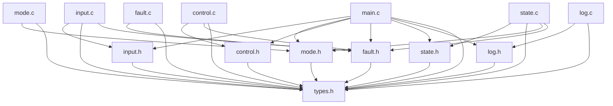

# ECU Simulator Technical Report

## 1. System Overview
The ECU Simulator is a modular, C-based system that mimics the core logic of a Vehicle Electronic Control Unit (ECU). It continuously reads inputs (speed, temperature, gear, mode), validates them against safety bounds, performs control logic checks, manages transient and persistent fault states, escalates system health states proportionally, and logs operation metrics in real-time.

The system relies on a cyclic simulation loop defined in `main.c` where each pass sequentially polls the status of the simulated vehicle. A Watchdog resetting loop is also integrated to perform soft-resets under continuous safe-mode failure states.

## 2. Dependency Graph

## 3. Core Data Structures (`types.h`)
The architecture is structured around three primary data structs passed by reference through the modules per cycle.

### `VehicleInput`
Represents the current telemetry provided by sensors:
- `speed` (`uint16_t`): Target vehicle velocity.
- `temperature` (`int16_t`): Main metric describing engine status.
- `gear` (`uint8_t`): Requested transmission gear position.
- `mode` (`Mode`): Enum for requested mode transition (OFF=0, ACC=1, IGNITION_ON=2).

### `VehicleStatus`
Maintains operational context describing system-wide functionality:
- `system_state` (`SystemState`): Highest level operational tier (`NORMAL`, `DEGRADED`, or `SAFE`).
- `active_mode`, `current_mode`, `previous_mode` (`Mode`): History of mode progressions.
- `highest_priority_issue` (`FaultPriority`): Ranks the most severe active issue for reporting mapping down to the dashboard logic.

### `FaultStatus`
The operational registry of errors allowing issues to be tracked, debounced, and quantified.
- `current_cycle_flags` (`uint16_t`): A bitmask representing active bit faults evaluated in the current cycle (`1<<0` Overspeed, `1<<1` Critical Overheat, etc.).
- `persistent_flags` (`uint16_t`): Latching faults that persisted past debouncing thresholds.
- `counters[5]` (`uint8_t`): Debounce counter arrays tracking how many continuous cycles an individual fault bit existed.
- Counters: `major_fault_count`, `warning_count`, `critical_fault_count`.

---

## 4. Module Specifications and Conditions

### `main.c` (Core Dispatcher & Watchdog)
- Orchestrates the sequence of validation and controls per loop cycle.
- Integrates a **Watchdog mechanism**: if 2 continuous cycles evaluate as terminal `SAFE` states, or if a user supplies `0 0 0 0` input, it overrides execution to enforce a hard start `init_system()`, zero out values, and trips `faults.reset_requested = 1`.

### `input.c` / `input.h`
- Handles sensor polling via standard input parsing. Filters unapproved inputs. 
- **Internal State Memory**: Retains `s_last_speed`, `s_last_temp`, `s_last_gear`, `s_last_mode` to mask invalid polling dynamically.
- **Boundaries**: Filters speed up to `200`, temp within bounds `[-40, 150]`, max gear `5`.
- **Validation**: 
  - Violating speed/temperature limits retains memory to the last-valid data frame transparently without generating a structured fault.
  - Violating gear/mode boundary checks corrects the values but actively sets `FAULT_BIT_INVALID_GEAR` or `FAULT_BIT_INVALID_MODE`.

### `mode.c` / `mode.h`
- Governs transmission lifecycle mapping preventing catastrophic state leaps.
- Authorized transition web map:
  - `MODE_OFF` <-> `MODE_ACC`
  - `MODE_ACC` <-> `MODE_IGNITION_ON`
  - `MODE_IGNITION_ON` -> `MODE_OFF` is functionally allowed.
- Attempts to transition outside this designated map enforces `MODE_FAULT` state allocation and increments `faults->major_fault_count`. 

### `control.c` / `control.h`
- Provides parametric monitoring to derive flags from domain thresholds:
  - **Critical Overheat** (> 110C): Asserts `FAULT_BIT_CRITICAL_OVERHEAT`, adds to `critical_fault_count` and `major_fault_count`.
  - **High Temp** (> 95C): Asserts `FAULT_BIT_HIGH_TEMP` and increments `warning_count`.
  - **Overspeed** (> 120km/h): Asserts `FAULT_BIT_OVERSPEED`, increments `major_fault_count`.
  - **Warning Speed** (>= 110km/h): Asserts warning metrics but has an isolated bit field setting.
- Calculates cascading priorities for `status->highest_priority_issue`. Hierarchy follows: `CRITICAL_OVERHEAT (4)` > `INVALID_GEAR_MODE (3)` > `OVERSPEED (2)` > `HIGH_TEMP (1)` > `NONE`.

### `fault.c` / `fault.h`
- Heart of the filtering and debouncing logic protecting the ECU from noisy, fluttering sensors.
- Each cycle, evaluates the `current_cycle_flags` up to `FAULT_MAX_TRACKED_BITS` (5 bits). 
- If a fault is actively parsed this cycle, increments corresponding index in `counters[]`. 
- **Condition**: Reaching `FAULT_PERSISTENCE_THRESHOLD` (3 cycles continuous) causes the fault to be securely written over to `persistent_flags`. 
- Unflagged bits immediately dump their counters down to `0`.

### `state.c` / `state.h`
- Computes aggregate high-level subsystem availability transitioning between `NORMAL`, `DEGRADED`, and `SAFE`.
- **NORMAL**: Steps up if faults pass critical thresholds:
  - `critical_fault_count >= 2` -> Escalate to `SAFE`
  - `major_fault_count >= 1` or `warning_count >= 3` or `critical_fault_count >= 1` -> Escalate to `DEGRADED`
- **DEGRADED**: 
  - Escalate to `SAFE` if `critical_fault_count >= 2`
  - Fully recovers back to `NORMAL` if explicit major/warning counters reach `0`.
- **SAFE**:
  - Requires watchdog reset variable verification (`faults->reset_requested == 1`) paired natively with an absolute cleared critical/major count array to resume operation.

### `log.c` / `log.h`
- Handles user-interface serialization. Leverages ANSI text injection formatting to simulate realistic telemetry dashboard diagnostics.
- Streams live state values over internal arrays concurrently alongside Disk I/O.
- Appends data tracking dynamically onto two files per cycle tick `valid_input.txt` and `faults_errors.txt` including timestamps forming a standard black box.
